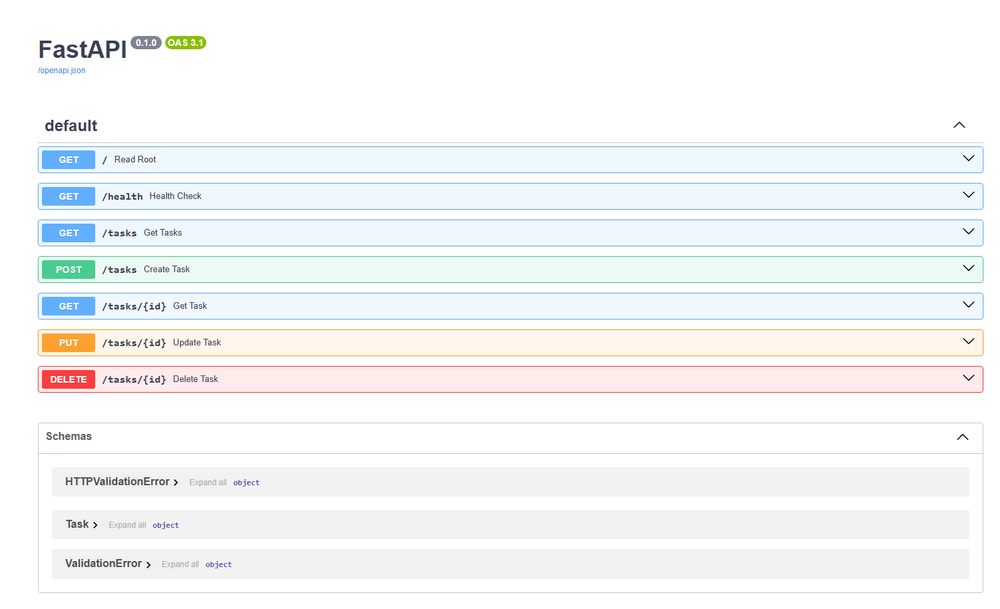
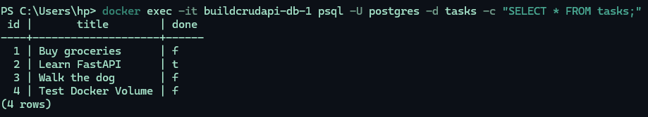

# BuildCRUDAPI

A **Task API** built with **FastAPI**, backed by **PostgreSQL** running in Docker. It supports full CRUD (Create, Read, Update, Delete) on a list of tasks, with input validation, correct HTTP status codes, and interactive API docs via Swagger UI.

The whole stack (API + database) starts with a single command: `docker compose up`.

## Architecture

This project started with in-memory storage, moved to SQLite, and now uses PostgreSQL in Docker. At every stage, **the service and route logic did not change** — only the repository/storage layer was swapped out. This proves the API's architecture correctly separates business logic from data storage.

## Install & Run

**Requirements:** [Docker Desktop](https://www.docker.com/products/docker-desktop/)

1. Copy `.env.example` to `.env` (the default values already match `compose.yaml`, so no edits are required to run locally):
   ```bash
   cp .env.example .env
   ```
2. Start the whole stack — API and database together:
   ```bash
   docker compose up
   ```
3. The API is available at `http://localhost:3000`. Interactive docs are at `http://localhost:3000/docs`.

To stop everything:
```bash
docker compose down
```
(Your data is safe — see [Persistence](#persistence) below. Use `docker compose down -v` only if you want to wipe the database volume too.)

## Environment Variables

| Variable       | Description                              | Example (from `.env.example`)                          |
|----------------|-------------------------------------------|----------------------------------------------------------|
| `DATABASE_URL` | Postgres connection string used by the API | `postgresql://postgres:dev@db:5432/tasks`                |

`.env` is git-ignored and holds your real local values. `.env.example` is committed so anyone cloning the repo knows what to set.

## Endpoints

| Method | Path          | Description              |
|--------|---------------|---------------------------|
| GET    | `/`           | API info                  |
| GET    | `/health`     | Health check               |
| GET    | `/tasks`      | List all tasks             |
| GET    | `/tasks/{id}` | Get a single task by id     |
| POST   | `/tasks`      | Create a new task           |
| PUT    | `/tasks/{id}` | Update an existing task      |
| DELETE | `/tasks/{id}` | Delete a task                 |

## Status Codes

| Code | Meaning                                          |
|------|---------------------------------------------------|
| 200  | Successful GET/PUT                                 |
| 201  | Task created                                        |
| 204  | Task deleted                                         |
| 400  | Invalid request body (e.g. missing/empty title)       |
| 404  | Task with given id not found                            |

## Example Requests

**List tasks:**
```bash
curl -i http://localhost:3000/tasks
```
```
HTTP/1.1 200 OK
date: Thu, 13 Aug 2026 13:53:01 GMT
server: uvicorn
content-length: 137
content-type: application/json

[{"id":1,"title":"Buy groceries","done":false},{"id":2,"title":"Learn FastAPI","done":true},{"id":3,"title":"Walk the dog","done":false}]
```

**Create a task:**
```bash
curl -i -X POST http://localhost:3000/tasks -H "Content-Type: application/json" -d "{\"title\":\"Test Docker Volume\"}"
```
```
HTTP/1.1 201 Created
date: Thu, 13 Aug 2026 13:53:23 GMT
server: uvicorn
content-length: 50
content-type: application/json

{"id":4,"title":"Test Docker Volume","done":false}
```

## Swagger UI

All endpoints are documented and testable at `/docs`:


## Persistence

Postgres data is stored in a named Docker volume (`taskdata`), independent of the app and database containers. This means data survives even a full container teardown and rebuild.

**How I verified it:**
1. Created a new task via `POST /tasks` (id `4`, "Test Docker Volume") and confirmed it via `GET /tasks`.
2. Fully tore down the stack with `docker compose down` (removes both containers and the network — everything except the named volume).
3. Brought the stack back up with `docker compose up`.
4. Ran `GET /tasks` again — task id `4` was still present, proving the data survived the container restart.

## Database Exploration

I verified the database directly using `psql` inside the running container:
```bash
docker exec -it taskdb psql -U postgres -d tasks -c "SELECT * FROM tasks;"
```
```
 id |     title      | done
----+-----------------+------
  1 | Buy groceries    | f
  2 | Learn FastAPI    | t
  3 | Walk the dog     | f
(3 rows)
```


