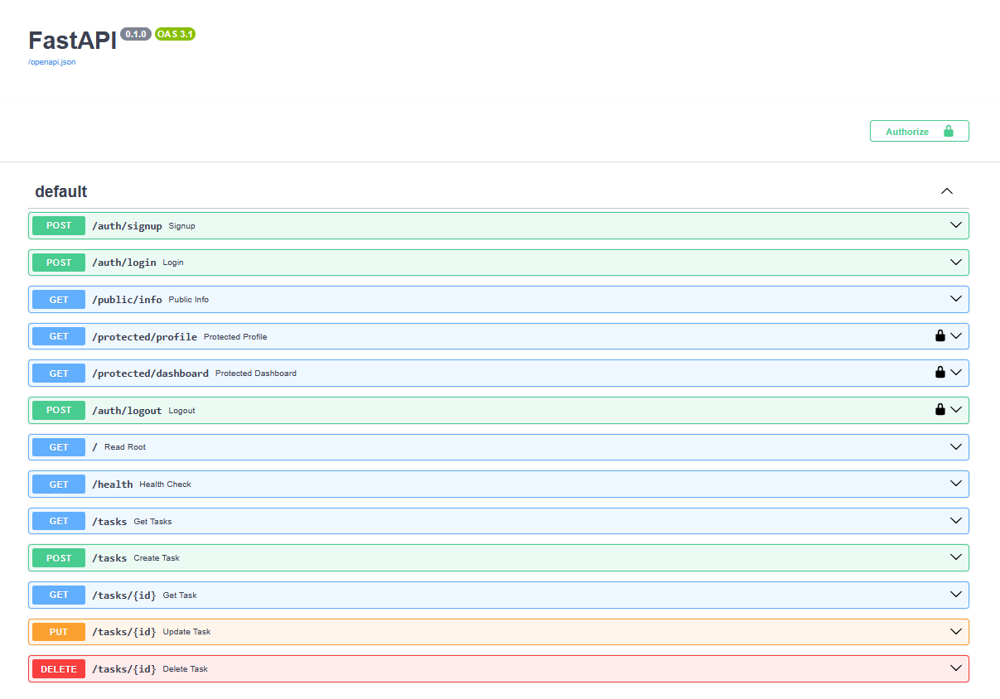

# BuildCRUDAPI

A **Task API** built with **FastAPI**, backed by **PostgreSQL** running in Docker, and secured with **Supabase Auth**. It supports full CRUD (Create, Read, Update, Delete) on a list of tasks, user sign up/log in/log out, and JWT-protected routes — all documented and testable via Swagger UI.

Supabase handles account storage, password hashing, and token signing. This API never touches a raw password or writes any cryptography itself — it only forwards credentials to Supabase and verifies the tokens it hands back.

## Architecture

This project started with in-memory storage, moved to SQLite, and now uses PostgreSQL in Docker. At every stage, **the service and route logic did not change** — only the repository/storage layer was swapped out. This proves the API's architecture correctly separates business logic from data storage.

Authentication was added as its own layer on top: a single reusable FastAPI dependency (`get_current_user`) verifies the caller's JWT against Supabase and is applied to every protected route, rather than duplicating the check per-route.

## Install & Run

**Requirements:** [Docker Desktop](https://www.docker.com/products/docker-desktop/), or Python 3.10+ if running locally without Docker. Either way, you'll also need a free [Supabase](https://supabase.com) project.

### Option A — Docker (recommended)

1. Copy `.env.example` to `.env` and fill in your Supabase values (see [Environment Variables](#environment-variables) below):
   ```bash
   cp .env.example .env
   ```
2. Start the whole stack — API and database together:
   ```bash
   docker compose up
   ```
3. The API is available at `http://localhost:3000`. Interactive docs are at `http://localhost:3000/docs`.

To stop everything:
```bash
docker compose down
```
(Your data is safe — see [Persistence](#persistence) below. Use `docker compose down -v` only if you want to wipe the database volume too.)

### Option B — Local dev without Docker

1. Make sure Postgres is reachable at the `DATABASE_URL` in your `.env` (e.g. via `docker compose up db` if you just want the database containerized).
2. Install dependencies and run the API directly:
   ```bash
   pip install -r requirements.txt
   uvicorn main:app --reload --port 8000
   ```
3. The API is available at `http://localhost:8000`. Interactive docs are at `http://localhost:8000/docs`.

You should see `Server running and connected to Supabase` in the terminal with no errors.

## Environment Variables

| Variable       | Description                                                                 | Example (from `.env.example`)                       |
|----------------|-------------------------------------------------------------------------------|--------------------------------------------------------|
| `DATABASE_URL` | Postgres connection string used by the API                                    | `postgresql://postgres:dev@db:5432/tasks`               |
| `SUPABASE_URL` | Your Supabase project URL (Project Settings → API)                            | —                                                         |
| `SUPABASE_KEY` | Your Supabase **anon** public key — never the `service_role` key              | —                                                         |
| `PORT`         | Port the API listens on when run outside Docker                               | `8000`                                                    |

`.env` is git-ignored and holds your real local values. `.env.example` is committed so anyone cloning the repo knows what to set. If you're setting up a new Supabase project from scratch, also turn **"Confirm email" off** under Authentication → Sign In / Providers → Email, so test accounts can log in immediately without clicking a confirmation link.

## Endpoints

| Method | Path                    | Description                                                        | Auth required                    |
|--------|--------------------------|---------------------------------------------------------------------|------------------------------------|
| POST   | `/auth/signup`           | Create a new user account                                           | None                                |
| POST   | `/auth/login`             | Authenticate and return a JWT                                       | None                                |
| POST   | `/auth/logout`            | End the current session                                             | `Authorization: Bearer <token>`   |
| GET    | `/public/info`            | Public, open data                                                   | None                                |
| GET    | `/protected/profile`      | Return the logged-in user's profile                                  | `Authorization: Bearer <token>`   |
| GET    | `/protected/dashboard`    | Second protected route (proves the auth guard is reusable)          | `Authorization: Bearer <token>`   |
| GET    | `/`                       | API info                                                             | None                                |
| GET    | `/health`                 | Health check                                                         | None                                |
| GET    | `/tasks`                  | List all tasks                                                       | None                                |
| GET    | `/tasks/{id}`             | Get a single task by id                                              | None                                |
| POST   | `/tasks`                  | Create a new task                                                    | None                                |
| PUT    | `/tasks/{id}`             | Update an existing task                                              | None                                |
| DELETE | `/tasks/{id}`             | Delete a task                                                        | None                                |

## Status Codes

| Code | Meaning                                                        |
|------|------------------------------------------------------------------|
| 200  | Successful GET/PUT, or login                                     |
| 201  | Resource created (task or user account)                          |
| 204  | Deleted, or logout succeeded — no content returned                |
| 400  | Invalid request body (e.g. missing/empty title, email, password) |
| 401  | Missing, malformed, invalid, or expired token                     |
| 404  | Task with given id not found                                       |

## Example Requests

**Sign up:**
```bash
curl -i -X POST http://localhost:8000/auth/signup \
  -H "Content-Type: application/json" \
  -d "{\"email\":\"test@example.com\",\"password\":\"password123\"}"
```

**Log in:**
```bash
curl -i -X POST http://localhost:8000/auth/login \
  -H "Content-Type: application/json" \
  -d "{\"email\":\"test@example.com\",\"password\":\"password123\"}"
```

**Call a protected route:**
```bash
curl -i http://localhost:8000/protected/profile \
  -H "Authorization: Bearer <PASTE_YOUR_ACCESS_TOKEN_HERE>"
```

**List tasks:**
```bash
curl -i http://localhost:3000/tasks
```
```
HTTP/1.1 200 OK
date: Thu, 13 Aug 2026 13:53:01 GMT
server: uvicorn
content-length: 137
content-type: application/json

[{"id":1,"title":"Buy groceries","done":false},{"id":2,"title":"Learn FastAPI","done":true},{"id":3,"title":"Walk the dog","done":false}]
```

**Create a task:**
```bash
curl -i -X POST http://localhost:3000/tasks -H "Content-Type: application/json" -d "{\"title\":\"Test Docker Volume\"}"
```
```
HTTP/1.1 201 Created
date: Thu, 13 Aug 2026 13:53:23 GMT
server: uvicorn
content-length: 50
content-type: application/json

{"id":4,"title":"Test Docker Volume","done":false}
```

## Swagger UI

All endpoints are documented and testable at `/docs`, including bearer-token authorization on protected routes via the **Authorize** button:



## Persistence

Postgres data is stored in a named Docker volume (`taskdata`), independent of the app and database containers. This means data survives even a full container teardown and rebuild.

**How I verified it:**
1. Created a new task via `POST /tasks` (id `4`, "Test Docker Volume") and confirmed it via `GET /tasks`.
2. Fully tore down the stack with `docker compose down` (removes both containers and the network — everything except the named volume).
3. Brought the stack back up with `docker compose up`.
4. Ran `GET /tasks` again — task id `4` was still present, proving the data survived the container restart.

## Database Exploration

I verified the database directly using `psql` inside the running container:
```bash
docker exec -it taskdb psql -U postgres -d tasks -c "SELECT * FROM tasks;"
```
```
 id |     title      | done
----+-----------------+------
  1 | Buy groceries    | f
  2 | Learn FastAPI    | t
  3 | Walk the dog     | f
(3 rows)
```

## Security notes

- Passwords are never stored or hashed by this API — Supabase owns that entirely.
- The `service_role` Supabase key is never used here, only the public `anon` key, which is safe to expose client-side.
- Token verification happens via a live network call to Supabase (`supabase.auth.get_user`), not by decoding the JWT locally — so a tampered or expired token is always caught.
- The auth guard is implemented once as a FastAPI dependency (`get_current_user`) and reused across every protected route, rather than duplicated per-route.
